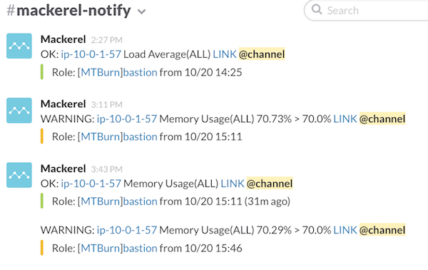

`$ revealup server --theme simple README.md`

---

# The technology behind M.T.Burn

---

# who?
- Tatsuro Hisamori(久森 達郎)
- MTBurn Ops/Dev

---

# what's M.T.Burn
- http://mtburn.jp/

___

## what's AppDavis
- Native Ads platform
- for SmartPhone / Web Browser

---

# Languages

___

## Objective-C
- Native SDK for iOS
- cocoapods available :)

___

## Java
- Native SDK for Android
- Eclipse
- robolectric

___

## Perl
- ServerSide API for Native SDK
- ver 5.18.2
- Starlet + Server::Starter is awesome
- many experience and know-how from FreakOut ;)

___

## Perl
- about Testing Perl Product

___

## JavaScript
- JavaScript SDK for Web Browser
- use Grunt :)
 - for lint, test and minify

___

## JavaScript
- Google JS Style Guide
 - http://cou929.nu/data/google_javascript_style_guide/
- id:cou929 :)

---

# Server Side

___

## AWS
- EC2 / ELB -> AutoScaling :)
- ElastiCache / RDS
- Route53

___

## AWS

___

## OS
- Ubuntu 14.04
- newer packages and less operating, than CentOS :)

___

## Packer
- Create AMI Image
- for EC2(Auto Scaling)
- under consideration serverspec.

___

## Docker
- Fluentd on Docker
- Norikra on Docker
 - using for single component on instance.
- Easy Build, Easy Deploy :)

___

## Docker

___

## Fluentd
- Log Collection
- Send Notification Message to Slack
- fluent-plugin-(norikra|mackerel|bigquery)

___

## Mackerel
- Server Instance Management
- Record Service Metric
- Notify System Trouble

___

## Mackerel(AutoScaling)

___

## Norikra
- http://norikra.github.io/
- Event Stream Processing with SQL.
 - request status count
 - count charge/payment per min
- Docker Image is available :) -> myfinder/docker-norikra

___

## Norikra

imp / click / conversion

___

## BigQuery
- Aggregation of ad delivery log
- Inspect of user operation log
- Record of batch execution log
 - any other everything post to BigQuery :p

---

# Development Tools

___

## github
- pull-request based development
 - code hosting.
 - issues.
 - review and merge.

___

## TravisCI
- Startup Plan
- iOS / Android / Perl / JavaScript

___

## Qiita Team
- Daily Report.
- Record of meeting.
- sharing tech infomations.

___

## Slack
- communication with business members.
- notify member activities.
- notify system trouble.

___

## Slack

___

## Slack

---

# 小休止

___

## 事業状況

___

## 事業状況
- サービスが急速に伸びてきている :)
- 大きく3回くらい構成を作りなおした :(
 - オンプレ -> クラウド
 - セルフ -> マネージド
- 成長の過程で使わなくなったものを紹介

---

# We stopped use.

___

## on-premises
- Server procurement
- Flexibility of Server Deployment
- Implementation speed

___

## Internal DNS Server
- we were using the Unbound
- switch to Route53 Internal DNS

___

## CentOS
- old kernel
- old package version

___

## Cobbler
- switch to AWS :)
- good by Cobbler, hello Cloud-init and AMI

___

## rsync -> s3 sync
- deploy server -> s3 -> app server
- without dependence on deployment server
 - And safely in auto scaling

___

## Puppet -> Ansible -> Shell
- Decreased complexity of server setup
- Don't need a lot of tools to the server setup

___

## Nagios/CloudForecast
- too many server list :(
- difficult to integrity management
- Mackerel is awesome :)

___

## HipChat
- HipChat xxxx
- frequently crash
- API not cool

___

## Hive/MapReduce
- switch to BigQuery
- Chose the BigQuery as compared to Redshift
- easy to use and very scalable
 - and cheap

---

# Conclusion

___

## Three important things.
- Catch-up of (market|technology) upstream
- Strong system to changes in the (market|technology) trends
- "Scalable" and "Less Operation"

___

# We do not forget the courage to chase them.

---

# Thanks
